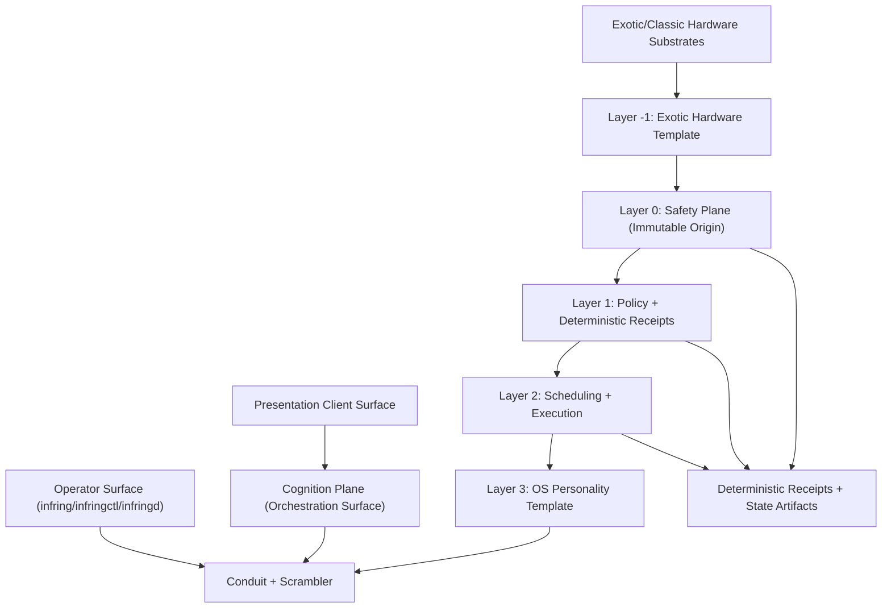

# InfRing Architecture

InfRing is built as a Rust-first deterministic core with an explicit split between:
- Authoritative Core (`core/**`)
- Orchestration Surface (`surface/orchestration/**`)
- Presentation Client (`client/**`)

Canonical architecture contract:
- `docs/SYSTEM-ARCHITECTURE-SPECS.md` (InfRing Layering Specification v1.0)

## InfRing Direction

InfRing is the target operating model: a portable autonomous substrate that runs unchanged across desktop, server, embedded, and high-assurance profiles.

- Rust kernel remains the single source of truth.
- Conduit is the only TS <-> Rust bridge.
- TS is reserved for flexible surfaces (UI, marketplace, extensions, experimentation).
- Orchestration Surface authority is Rust-first (`surface/orchestration/src/**`); `surface/orchestration/**` must remain at least `95%` Rust by tracked source lines, and TypeScript under `surface/orchestration/scripts/**` is adapter-only and must stay minimal.

## Three-Plane Metakernel

InfRing is explicitly modeled as a substrate-independent metakernel with three planes:

1. Safety plane (`planes/safety`, implemented in `core/`): deterministic authority stack with strict upward-only flow:
   - `core/layer_minus_one/` - Exotic Hardware Template (thin substrate adapter contract)
   - `core/layer0/` - Safety Plane origin (sacred/immutable contract)
   - `core/layer1/` - Policy Engine + deterministic receipts
   - `core/layer2/` - Scheduling + execution orchestration
   - `core/layer3/` - OS Personality Template (traditional OS growth layer)
2. Cognition plane (`planes/cognition`, implemented across `surface/orchestration/` and `client/`):
   - Orchestration Surface: request shaping, sequencing, clarification, recovery, and result packaging (non-canonical coordination only).
   - Presentation Client: rendering, input, UX shells, and presentation-local state.
3. Substrate plane (`planes/substrate`): runtime/backend descriptors for CPU/MCU/GPU/NPU/QPU/neural channels with explicit degradation contracts and fallback declarations.

Hard boundary:
- AI can propose; kernel authority decides.
- Client <-> core communication is conduit + scrambler only.
- Every substrate must declare fallback/degradation behavior.

Formal contract surfaces:
- Boundary/formal specs: `planes/spec/`
- Inter-plane contract schemas: `planes/contracts/`

## Core Stack Contract

The deterministic core stack is now explicitly layered and growth-safe:

- Layer 0 is immutable and proof-preserving.
- Layer -1 is where exotic hardware paradigms are adapted into standard envelopes.
- Layer 3 is where full OS personality capabilities grow (processes, VFS, drivers, syscalls, namespaces, windowing, networking).
- Cognition remains outside numbered core layers and never becomes root-of-correctness.
- Executable wrappers:
  - Layer -1 exotic base wrapper: `core/layer_minus_one/exotic_wrapper`
  - Layer 3 full OS extension wrapper: `core/layer3/os_extension_wrapper`

Driver analogy:

- `core/` is the drivetrain, brakes, and stability control.
- `surface/orchestration/` is the driving controller (trip planning + pacing + recovery).
- `client/` is the steering wheel, dashboard, and infotainment.
- Conduit is the harness between orchestration and core boundaries.

REQ-27 authority implementation:

- Importance scoring engine: `core/layer0/ops/src/importance.rs`
- Priority ordering + queue metadata: `core/layer0/ops/src/attention_queue.rs`
- Layer2 initiative primitives (score/action/priority queue shaping): `core/layer2/execution/src/initiative.rs`
- Regression guard (no subconscious authority in client): `client/runtime/systems/ops/subconscious_boundary_guard.ts`
- Cockpit + layer wrapper delta requirements: `docs/client/requirements/REQ-33-cockpit-stream-and-layer-wrappers.md`

Migration note:
- Strictly follow InfRing Layering Specification v1.0 with upward-only flow:
  `Layer -1 -> Layer 0 -> Layer 1 -> Layer 2 -> Layer 3 -> Cognition`.
- Existing `layer0/ops` authority lanes remain active while Layer2 ownership is completed incrementally without runtime regressions.

## Mech-Suit Cockpit Runtime

- `infringd` now defaults to `attach` semantics (attach-or-start) for cockpit-first operation.
- Startup origin-integrity checks support degraded timeout mode with deterministic retry scheduling, rather than hard startup deadlocks.
- Attention queue drain supports wait-based delivery (`--wait-ms`) for long-lived subscription behavior through conduit receipts.

## Filesystem Mapping (Authoritative)

| Plane | Contract Location | Implementation Location | Mutable Runtime Location |
|---|---|---|---|
| Safety | `planes/safety/` | `core/layer_minus_one/`, `core/layer0/`, `core/layer1/`, `core/layer2/`, `core/layer3/` | `core/local/` |
| Cognition | `planes/cognition/` | `surface/orchestration/` (coordination) + `client/` (`systems`, `lib`, `config`, `packages`, `tools`, `tests`, `observability`, `apps`, `developer`) | `client/runtime/local/` + `core/local/` (receipted orchestration artifacts) |
| Substrate | `planes/substrate/` | Template adapters in `core/layer_minus_one/` + capability descriptors under `planes/substrate/` | `core/local/` + `client/runtime/local/` |

Additional split rules:

- Source of truth code: `core/`, `surface/orchestration/`, and `client/`.
- Runtime/user/device/instance data: `client/runtime/local/` and `core/local/` only.
- Legacy compatibility links are disabled by default. Canonical runtime roots are direct:
  - `client/runtime/local/*` for client runtime data
  - `core/local/*` for core runtime data

## Direct Wiring Policy

- Deprecated compat surfaces (`client/runtime/state`, root `state/`, root `local/`) are not valid runtime paths.
- Client wrappers must call core through conduit/scrambler only; no policy authority exists in TS compatibility shells.
- Migration tooling may provide one-time compatibility options, but defaults are direct to canonical roots.
- Canonical path constants are centralized in:
  - TS: `client/runtime/lib/runtime_path_registry.ts`
  - Rust (conduit): `core/layer2/conduit/src/runtime_paths.rs`

## Conversation Eye (Default)

`conversation_eye` is a default cognition-plane sensory collector:

- Collector source: `client/cognition/adaptive/sensory/eyes/collectors/conversation_eye.ts`
- Synthesizer: `client/runtime/systems/sensory/conversation_eye_synthesizer.ts`
- Bootstrap/auto-provision: `client/runtime/systems/sensory/conversation_eye_bootstrap.ts`

Provisioning contract:

- Every `local:init` run auto-ensures `conversation_eye` exists in the eyes catalog.
- Runtime synthesis output is written to `client/runtime/local/state/memory/conversation_eye/nodes.jsonl`.
- Synthesized nodes are tagged with the conversation taxonomy:
  `conversation`, `decision`, `insight`, `directive`, `t1`.

Conversation hierarchy additions:

- Synthesized nodes now include leveled memory metadata:
  - `node1` (highest), `tag2`, `jot3` (lowest)
- Nodes include deterministic hex IDs and XML-style payload boundaries for low-cost parsing.
- Weekly node admission is quota-bound (10/week default) with bounded level-1 promotion overrides.

## Dream Sequencer + Auto Recall (Memory Integrity)

Memory relevance is continuously reordered through a dream-cycle sequencer:

- Matrix builder: `client/runtime/systems/memory/memory_matrix.ts`
- Sequencer runner: `client/runtime/systems/memory/dream_sequencer.ts`
- Auto recall lane: `client/runtime/systems/memory/memory_auto_recall.ts`

Contracts:

- Tag-memory matrix stores every indexed tag with ranked node IDs and scores.
- Scoring combines memory level (`node1>tag2>jot3`), recency, and dream inclusion signals.
- Dream cycle runs trigger sequencer reorder passes and emit updated ranked tags.
- New memory filings can trigger bounded top-match recall pushes to attention queue through conduit only.

Context guard:

- `memory_recall` query path enforces a hard context budget contract:
  - `--context-budget-tokens` (default `8000`, floor `256`)
  - `--context-budget-mode=trim|reject`
- Trim mode reduces excerpt/summaries to fit budget; reject mode fails closed with `context_budget_exceeded`.

## Low-Burn Reflexes

Client cognition exposes a compact reflex set for frequent operations under strict output caps:

- Registry/runner: `client/cognition/reflexes/index.ts`
- Reflexes: `read_snippet`, `write_quick`, `summarize_brief`, `git_status`, `memory_lookup`
- Each reflex response is capped at `<=150` estimated tokens.

## Why Root Is Governed

Repository root is curated by contract, not by visual minimalism alone.

Canonical source and product roots are still:

- source/runtime authorities (`core/`, `surface/`, `client/`, `adapters/`, `apps/`, `packages/`, `planes/`, `tests/`)
- documentation and governance (`README.md`, `ARCHITECTURE.md`, `docs/`, licenses, roadmap/governance files)
- build/bootstrap/operator metadata (`Cargo.toml`, `package.json`, lockfiles, CI/deploy manifests, `setup/`, `xtask/`)

The live root also contains managed support zones that are intentionally tolerated while the repo hardening program continues:

- generated/build/vendor bulk (`target/`, `node_modules/`, `artifacts/`, `audit_reports/`, `dist/`)
- local operator/runtime state (`local/`, `core/local/`, `client/runtime/local/`)
- research/reference surfaces (`benchmarks/`, `proofs/`, `research/`, `tools/`)

The governing rule is:

- canonical source authority stays inside `core/`, `surface/`, `client/`, `adapters/`, `tests/`, and deletable `apps/`
- per-instance runtime state belongs under `client/runtime/local/` and `core/local/`
- root-level support zones are allowed only when they are explicitly covered by the root-surface contract or tracked as deprecated debt

This means root is reviewable by policy even when it is not cosmetically tiny. Search/navigation tooling should default away from generated bulk, while the root-surface contract continues to burn down deprecated entries over time.

`planes/` is the living architectural contract surface. If code and docs diverge, `planes/*` + this file define the expected target state.

## System Map

Runtime subsystem ownership, interfaces, failure modes, and lane links are tracked in the generated map:

- [Generated System Map](docs/client/architecture/SYSTEM_MAP.md)
- Source registry: `client/runtime/config/system_map_registry.json`
- Generator lane: `client/runtime/systems/ops/system_map_generator.ts`

## Runtime Flow

1. A command enters from CLI or Presentation Client.
2. Orchestration Surface normalizes and sequences the request through explicit contracts.
3. Conduit normalizes the core-bound request into a typed envelope.
4. Layer 3 maps envelope into deterministic execution intents.
5. Layer 2 schedules execution; Layer 1 enforces policy/receipts.
6. Layer 0 evaluates constitution/safety gates and binds receipts to safety state.
7. Layer -1 executes through the active substrate template with declared fallback behavior.
8. Crossing + validation receipts are emitted for auditability.

## Portability Contract

- With TS present: conduit-backed orchestration and rich operator surfaces.
- Without TS: Rust core still runs with no kernel behavior drift.

## Related Docs

- [Getting Started](docs/client/GETTING_STARTED.md)
- Conduit Requirement (REQ-05)
- [Rust Primitive Requirement](docs/client/requirements/REQ-08-rust-core-primitives.md)
- [Layered Templates Requirement](docs/client/requirements/REQ-31-layered-templates-and-os-personality.md)
- [Mech-Suit Cockpit Runtime Requirement](docs/client/requirements/REQ-32-mech-suit-cockpit-persistent-push.md)
- [Executable System Map Requirement](docs/client/requirements/REQ-34-executable-system-map-registry.md)
- [Security Posture](docs/client/SECURITY_POSTURE.md)
- [Three-Plane Model](planes/README.md)
- [Three-Plane Formal Spec Surface](planes/spec/README.md)
- [Planes Contract Registry](planes/contracts/README.md)
- [Layer Rulebook](docs/client/architecture/LAYER_RULEBOOK.md)
- [Generated System Map](docs/client/architecture/SYSTEM_MAP.md)
