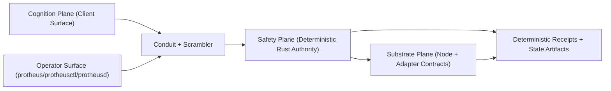

# Protheus Architecture

Protheus is built as a Rust-first kernel (trusted core) with a narrow conduit to TypeScript surfaces.

## InfRing Direction

InfRing is the target operating model: a portable autonomous substrate that runs unchanged across desktop, server, embedded, and high-assurance profiles.

- Rust kernel remains the single source of truth.
- Conduit is the only TS <-> Rust bridge.
- TS is reserved for flexible surfaces (UI, marketplace, extensions, experimentation).

## Three-Plane Metakernel

Protheus is explicitly modeled as a substrate-independent metakernel with three planes:

1. Safety plane (`planes/safety`, implemented in `core/layer0..2`): deterministic authority for policy, isolation, scheduling, receipts, and fail-closed execution.
2. Cognition plane (`planes/cognition`, implemented in `client/`): probabilistic model orchestration, retrieval, planning, persona overlays, and user-facing cognition surfaces.
3. Substrate plane (`planes/substrate`): runtime/backend descriptors for CPU/MCU/GPU/NPU/QPU/neural channels with explicit degradation contracts.

Hard boundary:
- AI can propose; kernel authority decides.
- Client <-> core communication is conduit + scrambler only.
- Every substrate must declare fallback/degradation behavior.

## Filesystem Mapping (Authoritative)

| Plane | Contract Location | Implementation Location | Mutable Runtime Location |
|---|---|---|---|
| Safety | `planes/safety/` | `core/layer0/`, `core/layer1/`, `core/layer2/` | `core/local/` |
| Cognition | `planes/cognition/` | `client/` (`systems`, `lib`, `config`, `packages`, `tools`, `tests`) | `client/local/` |
| Substrate | `planes/substrate/` | Core adapters in `core/layer0/` + substrate lane surfaces in `client/systems/` | `core/local/` + `client/local/` |

Additional split rules:

- Source of truth code: `core/` and `client/` only.
- Runtime/user/device/instance data: `client/local/` and `core/local/` only.
- Compatibility links from legacy paths are transitional and must not carry policy authority.

## Why Root Is Clean

Repository root is intentionally reduced to:

- source roots (`core/`, `client/`, `planes/`)
- governance and product docs (`README.md`, `ARCHITECTURE.md`, `SRS.md`, `TODO.md`)
- build/deploy metadata (`Cargo.toml`, `package.json`, lockfiles, CI/deploy manifests)

All high-churn runtime artifacts are localized to `client/local/` and `core/local/` so:

- source diffs stay reviewable
- sensitive/user-specific state is easier to reset or ignore
- open-source client surface can be published without leaking instance data

`planes/` is the living architectural contract surface. If code and docs diverge, `planes/*` + this file define the expected target state.

## System Map

## Runtime Flow

1. A command enters from CLI or a TS surface.
2. Conduit normalizes the command into a typed envelope.
3. Safety plane policy/constitution checks evaluate fail-closed.
4. Safety authority schedules deterministic execution against substrate adapters.
5. Cognition outputs are treated as probabilistic inputs unless authorized by safety policy.
6. Crossing + validation receipts are emitted for auditability.

## Portability Contract

- With TS present: conduit-backed orchestration and rich operator surfaces.
- Without TS: Rust core still runs with no kernel behavior drift.

## Related Docs

- [Getting Started](client/docs/GETTING_STARTED.md)
- [Conduit Requirement](client/docs/requirements/REQ-05-protheus-conduit-bridge.md)
- [Rust Primitive Requirement](client/docs/requirements/REQ-08-rust-core-primitives.md)
- [Security Posture](client/docs/SECURITY_POSTURE.md)
- [Three-Plane Model](planes/README.md)
- [Layer Rulebook](client/docs/architecture/LAYER_RULEBOOK.md)
