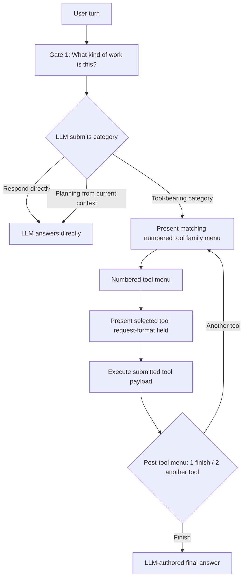
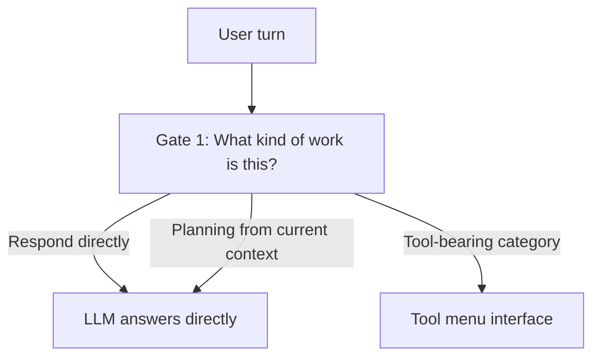
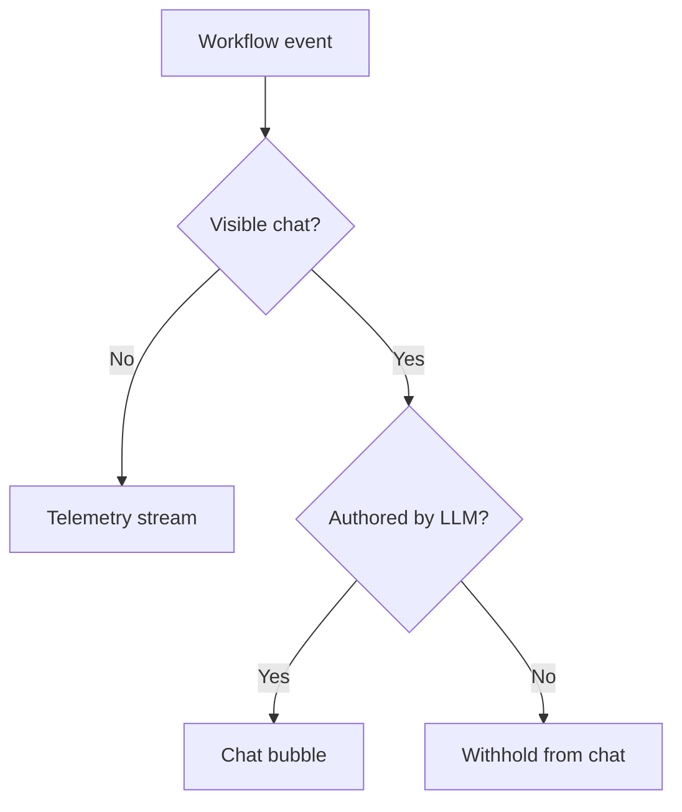
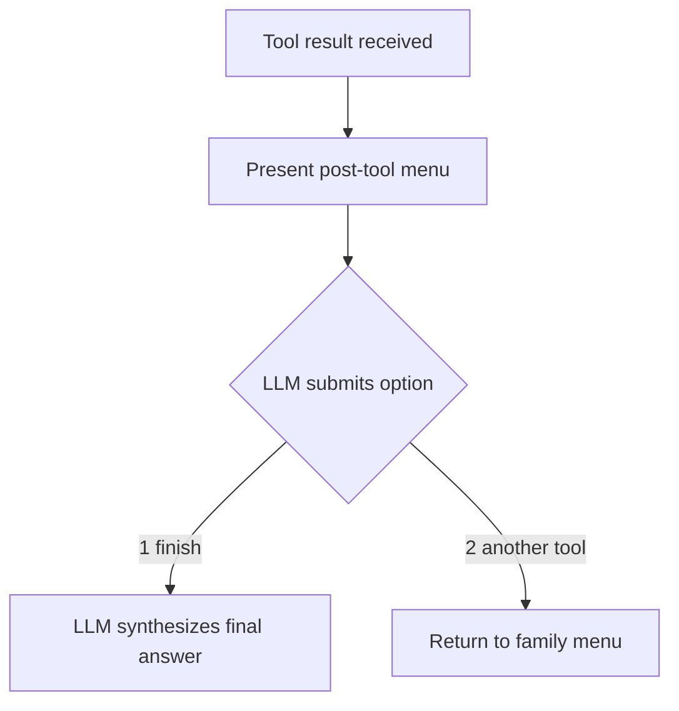

# Orchestration Control-Plane Workflow Maps

This file is a readability map for the control plane.

Scope: request decomposition, coordination, sequencing, recovery, and result packaging.

Current chat workflow rule: the workflow interface is not allowed to help the LLM pick tools. It may only present a multiple-choice menu, present a text-input payload field, execute the submitted payload, record telemetry, or hand final response authorship back to the LLM.

## Burnable CD / CD Player Model

The workflow JSON is the burnable CD. The Rust workflow reader/runtime is the CD player.

These maps are reference diagrams, not runtime authority. The selected `*.workflow.json` file owns the gates, options, transitions, tool family menus, input schemas, confirmation/cancel states, loopbacks, and final-output contract. Rust owns only loading, validation, deterministic transition execution, tool handoff, receipt binding, trace export, and Kernel policy enforcement.

Runtime traces should therefore identify the selected JSON source and report `interaction_source: json_workflow_spec`, `rust_reader_role: validate_execute_trace_only`, and `hardcoded_interaction_behavior_allowed: false`.

## 1) Default Turn Flow

## 2) Direct Response Flow

Direct response is the `Respond directly` branch at Gate 1. Current-context planning is also a no-tool category. There is no separate bypass workflow and no automatic bypass classifier.

## 3) Visibility + No-Injection Rule

## 4) Tool Loop

## 5) Ownership Reminder

- Kernel: truth, policy, admission, enforcement.
- Orchestration control plane: what should happen next (decompose/coordinate/sequence/recover/package).
- Shell: presentation and input only.

See also: `docs/workspace/orchestration_ownership_policy.md`.
Workflow format policy: `docs/workspace/workflow_json_format_policy.md`.

## 6) Trace Streams + Exports

The workflow now emits separate streams so the UI harness can render each channel differently:

- `workflow_state` (machine-readable stage transitions)
- `ui_status` (short user-facing status lines like "Searching the web")
- `decision_summary` (LLM submissions and guard telemetry only; no tool recommendations)
- `tool_execution` (tool/audit timeline)

Export formats (same turn, same trace id):

- JSON object in `response_workflow` (live UI payload)
- JSONL append history (`<state_root>/chat_ui/workflow_trace_history.jsonl`)
- Timeline text snapshot (`<state_root>/chat_ui/workflow_trace_latest.timeline.txt`)
