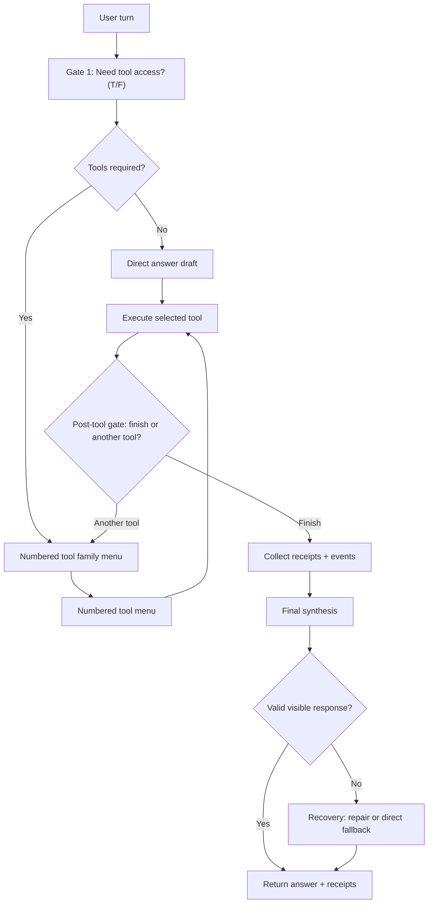
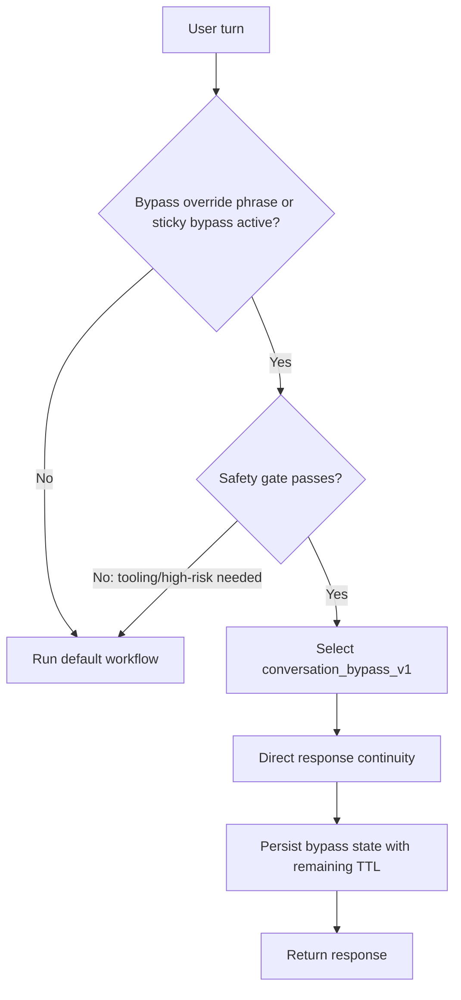
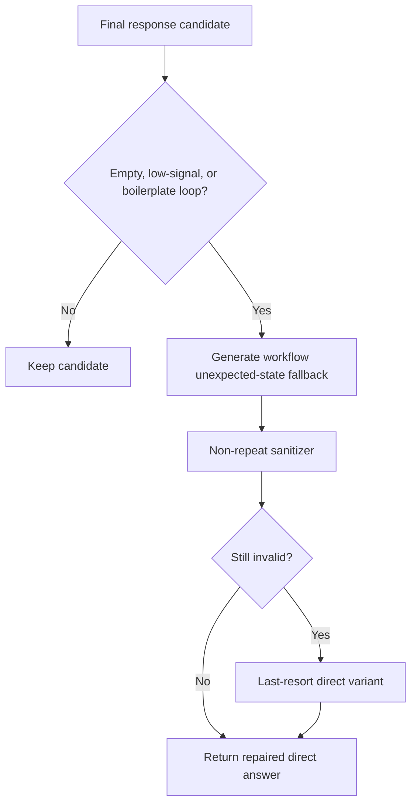

# Orchestration Control-Plane Workflow Maps

This file is a readability map for the control plane.

Scope: request decomposition, coordination, sequencing, recovery, and result packaging.

## 1) Default Turn Flow

## 2) Conversation Bypass Flow (`conversation_bypass_v1`)

## 3) Recovery + Loop Guard Flow

## 4) Ownership Reminder

- Kernel: truth, policy, admission, enforcement.
- Orchestration control plane: what should happen next (decompose/coordinate/sequence/recover/package).
- Shell: presentation and input only.

See also: `docs/workspace/orchestration_ownership_policy.md`.

## 5) Trace Streams + Exports

The workflow now emits separate streams so the UI harness can render each channel differently:

- `workflow_state` (machine-readable stage transitions)
- `ui_status` (short user-facing status lines like "Searching the web")
- `decision_summary` (concise rationale snapshots)
- `tool_execution` (tool/audit timeline)

Export formats (same turn, same trace id):

- JSON object in `response_workflow` (live UI payload)
- JSONL append history (`<state_root>/chat_ui/workflow_trace_history.jsonl`)
- Timeline text snapshot (`<state_root>/chat_ui/workflow_trace_latest.timeline.txt`)
