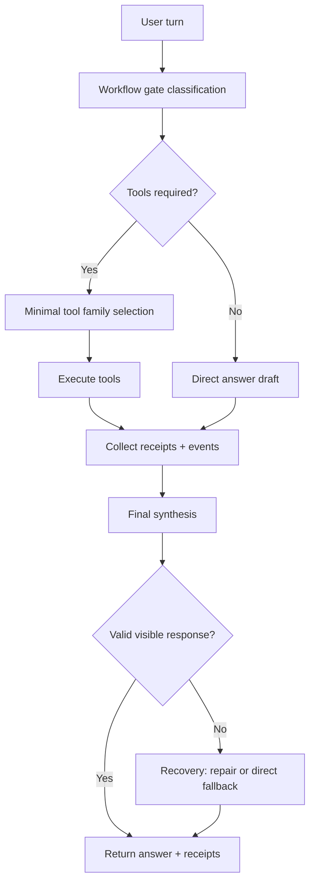
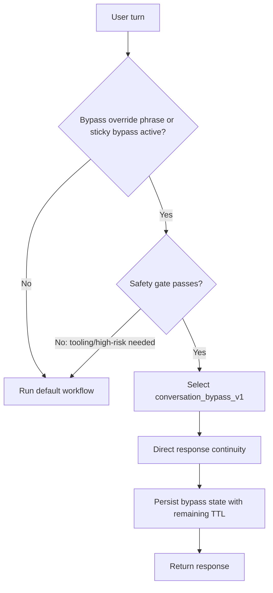
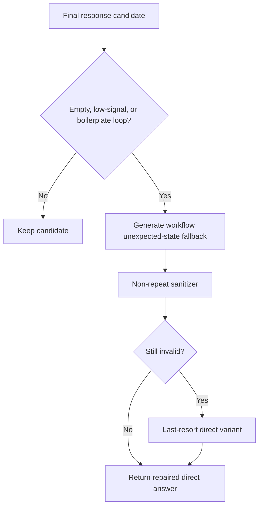

# Orchestration Control-Plane Workflow Maps

This file is a readability map for the control plane.

Scope: request decomposition, coordination, sequencing, recovery, and result packaging.

## 1) Default Turn Flow

## 2) Conversation Bypass Flow (`conversation_bypass_v1`)

## 3) Recovery + Loop Guard Flow

## 4) Ownership Reminder

- Kernel: truth, policy, admission, enforcement.
- Orchestration control plane: what should happen next (decompose/coordinate/sequence/recover/package).
- Shell: presentation and input only.

See also: `docs/workspace/orchestration_ownership_policy.md`.
